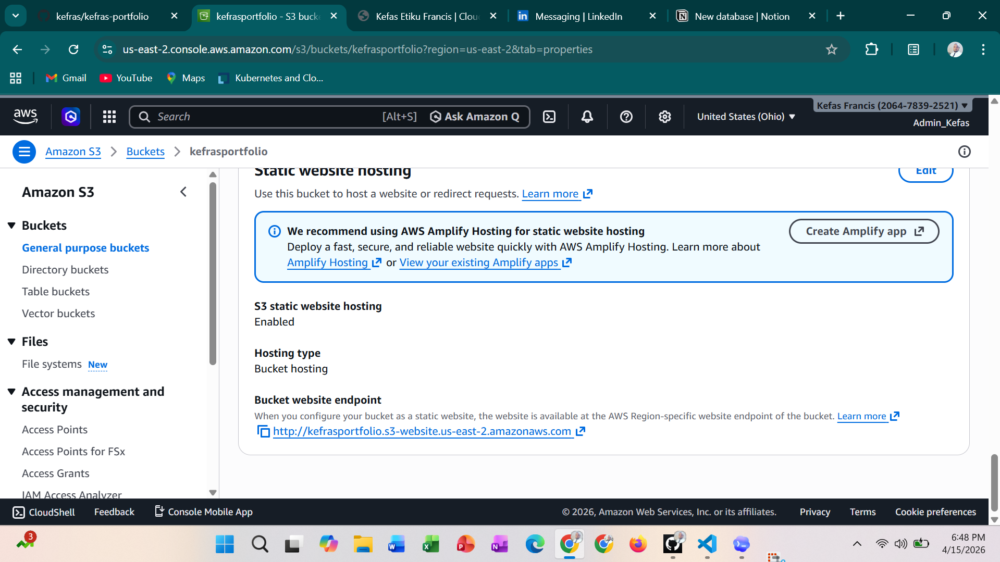

* **☁️ Kefas Etiku Francis – Cloud/DevOps Portfolio Website**

A modern responsive personal portfolio website built with HTML5 + CSS3 and deployed on Amazon S3 Static Website Hosting.

This project showcases my growing hands-on skills in:

* Cloud Computing
* Linux Administration
* AWS Deployment
* Docker & Kubernetes
* CI/CD Automation
* DevOps Engineering

⸻

🌐 Live Demo

🔗 <a href="https://staging.d2g11d7mgrawof.amplifyapp.com/">
  <button type="button">Click Me!</button>
</a>

⸻

* **📸 Project Preview**

⸻

* **🚀 Key Features**

* ✅ Clean modern UI/UX
* ✅ Fully responsive design
* ✅ Cloud/DevOps professional branding
* ✅ Hero section + About section
* ✅ Tech stack showcase
* ✅ AWS S3 deployment
* ✅ Mobile-friendly layout
* ✅ Production-style folder structure

⸻

🛠️ Tech Stack

HTML5
CSS3
AWS S3
Linux
Git
GitHub

⸻

📂 Folder Structure

cloud-devops-portfolio/

│── index.html

│── screenshot.png

│── README.md

⸻

* **☁️ AWS Deployment Workflow**

This project was deployed using Amazon S3 Static Website Hosting.

Steps Followed

1. Created S3 bucket
2. Disabled block public access
3. Enabled static website hosting
4. Uploaded portfolio files
5. Added public bucket policy
6. Accessed website endpoint
7. Verified successful deployment

⸻

* **🔐 S3 Bucket Policy**

{
  "Version": "2012-10-17",
  "Statement": [
    {
      "Sid": "PublicReadGetObject",
      "Effect": "Allow",
      "Principal": "*",
      "Action": "s3:GetObject",
      "Resource": "arn:aws:s3:::Kefas-portfolio/*"
    }
  ]
}

⸻

📚 What I Learned

Through this project, I strengthened my understanding of:

* Static website hosting on AWS
* S3 bucket permissions and policies
* Public object access
* Cloud deployment workflows
* Frontend page structure
* Version control best practices

⸻

🎯 Future Improvements

* 🔄 CI/CD with GitHub Actions
* 🐳 Docker container version
* ☸️ Kubernetes deployment
* 🌍 CloudFront CDN integration
* 🔐 HTTPS with ACM
* 🌐 Custom domain with Route 53
* 🏗️ Terraform IaC deployment

⸻

👨🏽‍💻 About Me

I am Kefas Etiku Francis, a Computer Science student at Miva Open University, building strong practical skills in Cloud Computing, DevOps, Linux, Kubernetes, and AWS.

I am open to:

* Internship opportunities
* SIWES placements
* Cloud/DevOps collaboration
* Entry-level engineering roles

⸻

📬 Connect With Me

* GitHub: https://github.com/kefras
* LinkedIn: https://linkedin.com/in/kefas
* Email: kefasetikufrancis@gmail.com

⸻

⭐️ Show Your Support

If you like this project, please star this repository and connect with me for cloud and DevOps opportunities.
:::

